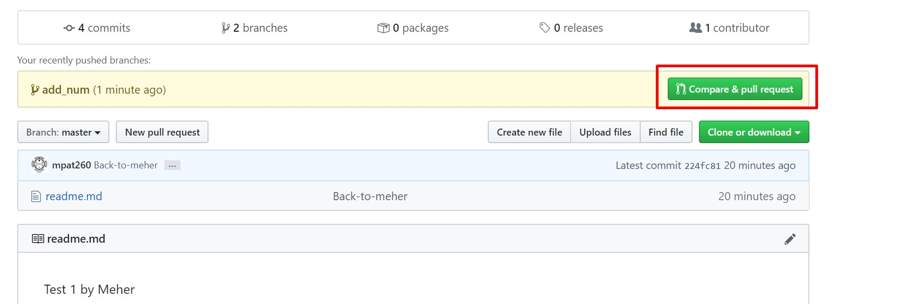
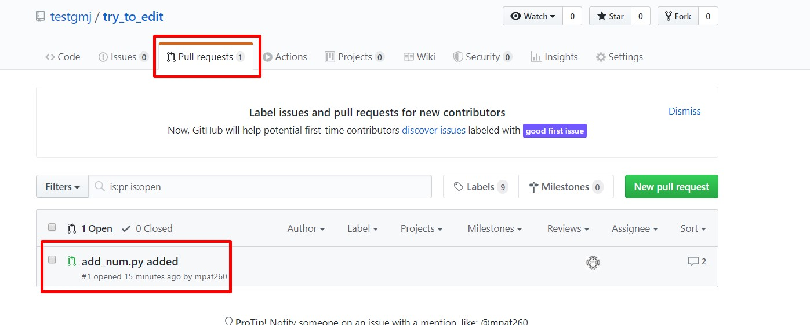
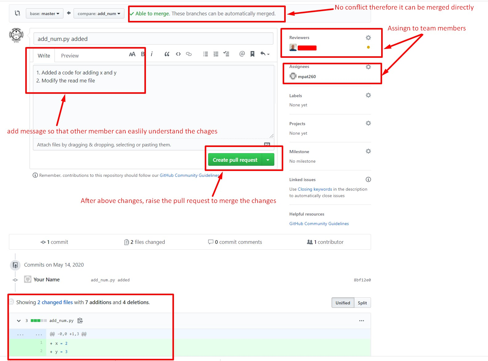
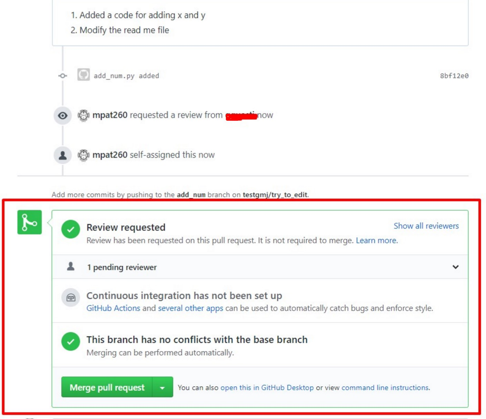
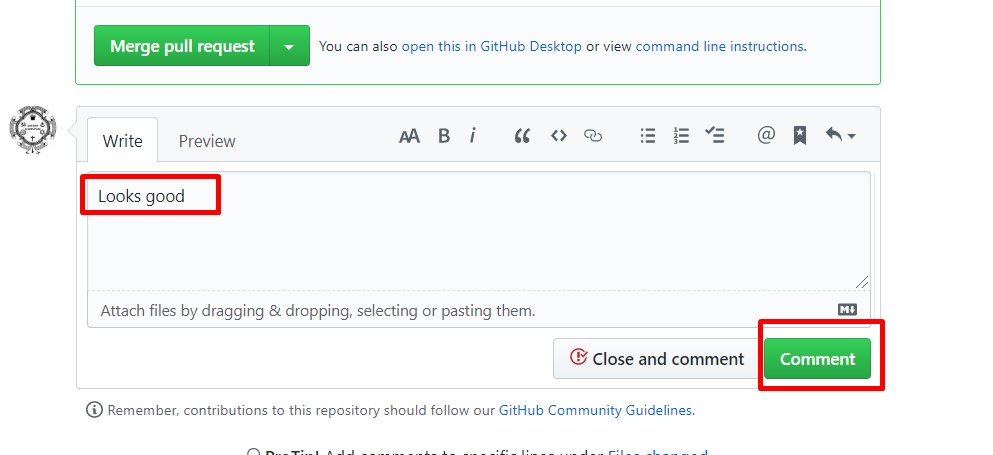
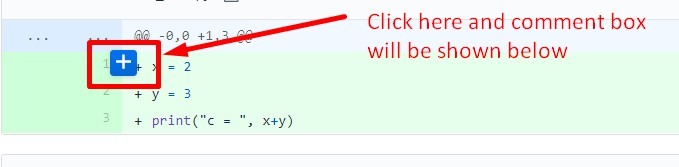
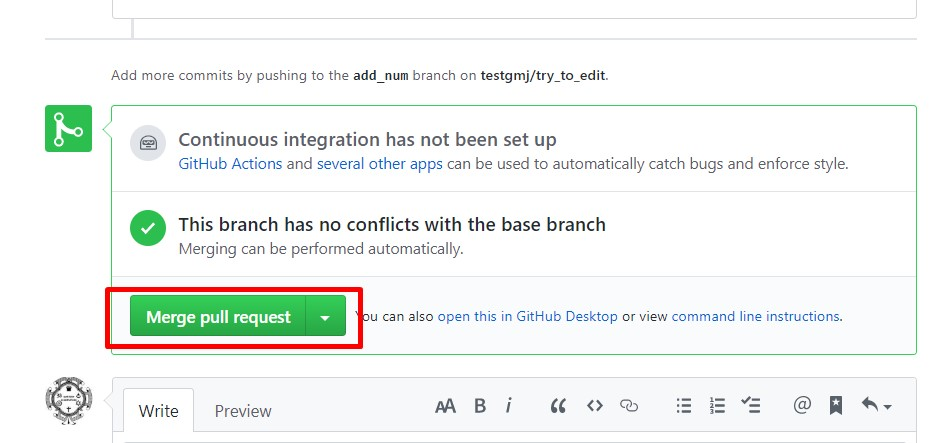
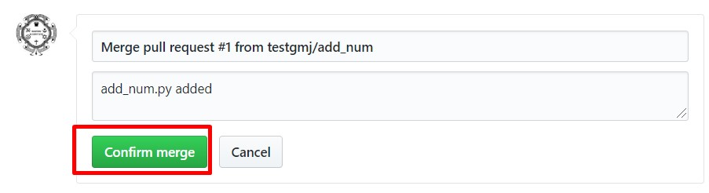
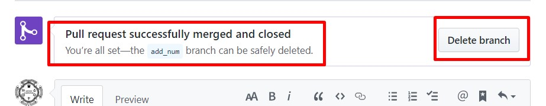
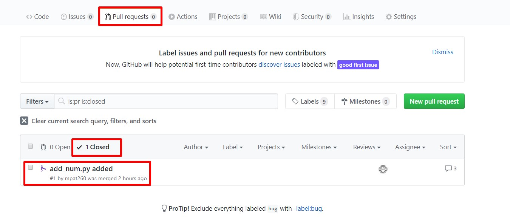

Commands Summary
****************

Following is the list of commands which are used in this tutorial.

.. Table:: Commands summary

    +-----------------------------------+---------------------------------------------------+
    | Commands                          | Descriptions                                      |
    +===================================+===================================================+
    | **Local Repository**              |                                                   |
    +-----------------------------------+---------------------------------------------------+
    | sudo apt-get install git          | Install git in Linux Ubuntu                       |
    +-----------------------------------+---------------------------------------------------+
    | git config --global               | Set username as 'meher'                           |
    | user.name *meher*                 |                                                   |
    +-----------------------------------+---------------------------------------------------+
    | git config --global user.email    | Set email as 'abc@gmail.com                       |
    | *abc@gmail.com*                   |                                                   |
    +-----------------------------------+---------------------------------------------------+
    | git config --global               | Set 'vim' as default text-editor                  |
    | core.editor "vim"                 |                                                   |
    +-----------------------------------+---------------------------------------------------+
    | git config --global               | Cache username and password                       |
    | credential.helper cache           |                                                   |
    +-----------------------------------+---------------------------------------------------+
    | git init                          | Initialize git repository                         |
    +-----------------------------------+---------------------------------------------------+
    | git status                        | File status i.e. modified and untracked etc.      |
    +-----------------------------------+---------------------------------------------------+
    | git add .                         | Add all untracked files                           |
    +-----------------------------------+---------------------------------------------------+
    | git add *file1 file2*             | Add (stage) file1 and file2                       |
    +-----------------------------------+---------------------------------------------------+
    | git rm --cached *file1*           | Remove the staged file *file1*                    |
    +-----------------------------------+---------------------------------------------------+
    | git commit -m *"commit message"*  | Commit stage file with 'commit message'           |
    +-----------------------------------+---------------------------------------------------+
    | git log                           | Show detail list of commits                       |
    +-----------------------------------+---------------------------------------------------+
    | git log --oneline                 | Show hash and commit name only                    |
    +-----------------------------------+---------------------------------------------------+
    | git log --graph                   | Show commits in the form of graph                 |
    +-----------------------------------+---------------------------------------------------+
    | git log --oneline --graph         | Show online-commit in the form of graph           |
    +-----------------------------------+---------------------------------------------------+
    | git diff                          | Differences between unstaged files                |
    |                                   | and previous commit                               |
    +-----------------------------------+---------------------------------------------------+
    | git diff --cached                 | Differences between staged files and              |
    +-----------------------------------+---------------------------------------------------+
    | git diff --stat                   | Show only changed filenames (not the details)     |
    +-----------------------------------+---------------------------------------------------+
    | git reset                         | Remove *all files* from stage list                |
    |                                   | (i.e. back to modified)                           |
    +-----------------------------------+---------------------------------------------------+
    | git reset *file1*                 | Remove *file1* from stage list                    |
    |                                   | (i.e. back to modified)                           |
    +-----------------------------------+---------------------------------------------------+
    | git reset --hard *13802e3*        | Reset to previous commit with hash 13802e3        |
    +-----------------------------------+---------------------------------------------------+
    | git reset HEAD --hard             | remove all changes after last commit              |
    +-----------------------------------+---------------------------------------------------+
    | git checkout *file1*              | Remove changes from non-staged file1              |
    |                                   | to previous commit                                |
    +-----------------------------------+---------------------------------------------------+
    | git rm *file1*                    | Delete file1 from git (but available              |
    |                                   | in previous commit                                |
    +-----------------------------------+---------------------------------------------------+
    | git branch                        | Show all the branches                             |
    +-----------------------------------+---------------------------------------------------+
    | git branch *branch1*              | Create branch1                                    |
    +-----------------------------------+---------------------------------------------------+
    | git branch -d *branch1*           | Delete branch1                                    |
    +-----------------------------------+---------------------------------------------------+
    | git checkout *branch1*            | Go to branch1                                     |
    +-----------------------------------+---------------------------------------------------+
    | git checkout master               | Go to master branch                               |
    +-----------------------------------+---------------------------------------------------+
    | git merge *branch1*               | Merge the *branch1* to current branch e.g. master |
    +-----------------------------------+---------------------------------------------------+
    | git checkout *13802e3*            | Create new branch from previous commit 13802e3    |
    +-----------------------------------+---------------------------------------------------+
    | git checkout -b *branch1*         | First checkout and then create branch             |
    +-----------------------------------+---------------------------------------------------+
    | **Remote repository**             |                                                   |
    +-----------------------------------+---------------------------------------------------+
    | git remote add *repoName*         | Add remote repo with name 'repoName'              |
    | *https://url_of_repo*             |                                                   |
    +-----------------------------------+---------------------------------------------------+
    | git remote -v                     | Show list of added repoNames                      |
    +-----------------------------------+---------------------------------------------------+
    | git remote remove *repoName*      | Remove repoName from list                         |
    +-----------------------------------+---------------------------------------------------+
    | git push *repoName* *branch1*     | Push 'branch1' to 'repoName'                      |
    +-----------------------------------+---------------------------------------------------+
    | git push *repoName* --all         | Push all branches to repoName                     |
    +-----------------------------------+---------------------------------------------------+
    | git clone                         | Clone or download remote repository               |
    | https://nameOfRemoteRepository    |                                                   |
    +-----------------------------------+---------------------------------------------------+
    | git clone  --depth 1              | Clone only last branch                            |
    | https://nameOfRemoteRepository    |                                                   |
    +-----------------------------------+---------------------------------------------------+
    | git pull *repoName* *branchName*  | Download and merge 'branchName' of repoName       |
    +-----------------------------------+---------------------------------------------------+
    | git fetch *repoName* *branchName* | Download, but not merge repoName                  |
    +-----------------------------------+---------------------------------------------------+

Git Local repository
********************

Git is the version control system which is used for tracking the changes in the codes. Also, if we made some wrong changes in the code or we are not happy with current changes, then the previous versions of codes can be restored using git. Lastly, version control systems allows to work in a group, so that different people can solve different problems and finally all the solution can be merge together. In this way, projects are more manageable and can be completed efficiently. Further, git repository can be stored on the local machine as well remotely on the web. In this chapter, git local repository is discussed, whereas git remote repository described in next chapter. Finally, last chapter shows the list of command which we learn in this tutorial.  

Installation
============

We need to install git to use this tutorial. Git can be install on **Ubuntu** using following command. 

.. code-block:: shell

  sudo apt-get install git

For more information or to install Git on other linux systems, window or macs, please visit the git website http://git-scm.com/ 

Git Configuration
=================

First we need to configure the git setting so that git can identify the person who is making changes in the codes. For this use following commands, 

First two commands set the username and email id, whereas third command (optional) sets the default text-editor for git. For example, vim is set as default editor here, therefore vim will be open for the commands which requires some inputs from users. 

.. code-block:: shell

  $ git config --global user.name meher
  $ git config --global user.email mkpatel@gmail.com
  $ git config --global core.editor "vim"

Git stores these information in .gitconfig file, which is stored in the home directory. In Ubuntu, content of this file can be seen using following commands, 

.. code-block:: shell

  $ cd 
  $ vim .gitconfig
  [user]
    email = mkpatel@gmail.com
    name = meher
  [core]
    editor = vi
 
Use following command to cache the username and password, so that we need not to give credential values, i.e. username and password, for each git connection to remote repository, 

.. code-block:: shell

    $ git config --global credential.helper cache

Create project directory
========================

Lets create a project directory at any desired location and initialize the git repository in that directory as follows, 

.. code-block:: shell

  $ mkdir gitProject
  $ cd gitProject
  $ git init

Last command will create a git repository, which is store in .git folder. Use following commands to view the content of this folder, 

.. code-block:: shell

  $ ls -A
  .git

  $ cd .git && ls -A
  branches  config  description  HEAD  hooks  info  objects  refs

  $ cd ..
 

Now, any changes in the folder 'gitProject' will be tracked by the git. To see the change status in the folder, use 'status' command as follows, 

.. code-block:: shell

  $ git status 
  Initial commit
  nothing to commit

Since, no changes are made in the directory, therefore status commands shows that there is 'nothing to commit'. 

Add files
=========

Next, add one file e.g. 'hello.py' in the folder, with following contents, 

.. code-block:: python

  # hello.py

  print("hello 1")

Now, run the status command again and the changes in the directory will be displayed as below, 

.. code-block:: shell

  $ git status
  On branch master

  Initial commit

  Untracked files:
    (use "git add <file>..." to include in what will be committed)

    .hello.py.swp
    hello.py

  nothing added to commit but untracked files present (use "git add" to track)

Above message shows that there are two untracked files in the project directory i.e. hello.py and .hello.py.swp. Second file i.e. .swp is the file generated by vim editor. Since, we do not want to keep track of files which are generated by editors or software e.g. .pyc (python) or .so(C/C++), therefore these files should be removed from tracking list; which can be done by using .gitignore file as shown next. 

.gitignore
==========

Create a .gitingore file in project directory; add file extensions and folder names, to avoid tracking of certain files e.g. automatically generated files i.e. .pyc and .swp or folders i.e. build etc. These files can be added to .gitignore file as shown below, 

.. code-block:: shell

  .gitignore
  *.swp
  *.pyc
  
  # sphinx-build folders
  build
  :generated

  # Byte-compiled / optimized / DLL files
  __pycache__/
  *.py[cod]
  *$py.class

  # C extensions
  *.so

After adding .gitingore file, run status command again as below; we can see that .swp file is not displayed now, as it is removed from the tracking list. 

.. code-block:: shell
  
  $ git status
  [...]
  Untracked files:
    (use "git add <file>..." to include in what will be committed)

    hello.py
  [...]
  
Untracked, Staged and Modified file
===================================

Untracked file
--------------

The newly added files in the project directory are considered as untracked files. Since hello.py is created curretly and it is new to git therefore it is shown as 'Untracked' file by status command. Status will remain the same until this file is added to git as shown next. 

Staged file
-----------

When any file (untracked or modified) is added to git, then it is called staged file. 'git add' command' is used to add file to git as shown in below commands, 

.. code-block:: shell

  $ git add hello.py
  $ git status
  [...]
  Changes to be committed:
    (use "git rm --cached <file>..." to unstage)

    new file:   hello.py
  [...]
 
Results of above status commands shows two things.

* First, use "git rm --cached <file>..." to unstage, which means that files is staged and we can use 'git rm' command to unstage it. 
* Further, stage files are the files which are ready for the backup (but not backed up yet), hence git displays the message that 'changes to be committed, new file: hello.py'. Commit is used to backup the staged file as shown next.

Commit
------

'git commit' command is used to store the changes in the git so that these can be recovered later. Each commit requires a name so that we can identify the changes made during those commits. Commit operation can be performed as below, 

.. code-block:: shell

  $ git commit -m "commit1 hello.py is added"
  [master (root-commit) 5e1b96b] commit1 hello.py is added
   1 file changed, 5 insertions(+)
   create mode 100644 hello.py

  $ git status
  On branch master
  nothing to commit, working directory clean

Since, all the changes are added to git using commit, therefore status command displays that there is nothing to commit now.

Note that, if 'git commit'  is used in place of 'git commit -m "commit1 hello.py is added"', then a vim editor will pop-up (as vim is set as default editor) and we need to enter the commit message on the top of that file i.e. "commit1 hello.py is added".  

Modified files
--------------

If we change the 'hello.py' file again, then git considered as modified file (instead of new file). To understand this, let add one more line at the end of hell.py as below,

.. code-block:: python

  # hello.py

  print("hello 1")
  print("hello 2")

Now, use git status command and it will show that the hello.py file is modified file. Also, we can add and commit the modified file (not new file) using one line command i.e. git -am as shown below, 

.. code-block:: shell

  $ git status
  [...]
  Changes not staged for commit:
  [...]
    modified:   hello.py

  $ git commit -am "Commit2 hello.py modified"
  [master d524017] Commit2 hello.py modified
   1 file changed, 1 insertion(+)

Git log
=======

Git log command is used to see the list of commits. Following git log commands are quite useful, 

.. code-block:: shell

  $ git log
  commit d52401733f7cd237cd837cd362bf3e0c546aef47
  Author: meher <mkpatel@gmail.com>
  Date:   Mon Jan 30 22:13:08 2017 +0000

      Commit2 hello.py modified

  commit 5e1b96bd7e89c94ccb1b6b85704ed23958cdff59
  Author: meher <mkpatel@gmail.com>
  Date:   Mon Jan 30 22:00:42 2017 +0000

      commit1 hello.py is added
      
  $ git log --oneline
  d524017 Commit2 hello.py modified
  5e1b96b commit1 hello.py is added

'git log' displays the details of commits whereas 'git log --oneline' give the hashes of the commits (i.e. numbers at the beginning) and commit name only.

To see list of commits in the form of graph, use following command (red lines will be shown on the side of the commits, which are quite useful, when branching is used in later part of the tutorial).

.. code-block:: shell

  $ git log --graph
  [...]

  $ git log --oneline --graph
  [...]
 
Git diff
========

'git diff' is used to see the difference between last commit and current files. Let add one more line at the end of hello.py file. Then run the ‘git diff’ command to see the changes in the file as below. 

.. code-block:: python

  # hello.py

  print("hello 1")
  print("hello 2")
  print("hello 3")

* **git diff**: shows the differences between **unstaged files** and previous commit
* **git diff - -cached** shows the differences between **staged files** and previous commit. 
* **- -stage**: it is used to avoid details of the differences. 

.. code-block:: shell

  $ git diff 
  diff --git a/hello.py b/hello.py
  index 78860b8..181ed03 100644
  --- a/hello.py
  +++ b/hello.py
  @@ -3,4 +3,5 @@
   
   print("hello 1")
   print("hello 2")
  +print("hello 3")
   
  $ git diff --stat
   hello.py | 1 +
   1 file changed, 1 insertion(+)

  $ git diff --cached

Note that - -cached command does not show any difference as there is no difference between stage file and previous commit. Once hello.py is staged, then - -cached command will show the differences as displayed below, 

.. code-block:: shell

  $ git add hello.py 
  $ git diff

  $ git diff --cached
  diff --git a/hello.py b/hello.py
  index 78860b8..181ed03 100644
  --- a/hello.py
  +++ b/hello.py
  @@ -3,4 +3,5 @@
   
   print("hello 1")
   print("hello 2")
  +print("hello 3")
   
  $ git diff --cached --stat
   hello.py | 1 +
   1 file changed, 1 insertion(+)

Finally commit these changes as follows, 

.. code-block:: shell

  $ git commit -m "commit3 hello 3 is added"

Git reset
=========

‘git reset’ is opposite of ‘git add’.. Reset command can be used in two ways, i.e. to reset the staged files in current working directory or reset the directory to previous commits, as discussed in this section. 

Reset stage file
----------------

 Reset can be used when we want to unstage some file which is added accidentally. Let add one more line in the end of hello.py as below,  

.. code-block:: python

  # hello.py

  print("hello 1")
  print("hello 2")
  print("hello 3")
  print("hello 4 Password : 1234")

Next, stage this file using 'git add' and then unstage it using 'git reset' command as shown below, 

.. code-block:: shell

  $ git status
  [...]
  Changes not staged for commit:
  [...]
      modified:   hello.py
  [...]

  $ git add hello.py
  $ git status
  [...]
  Changes to be committed:
  [...]
      modified:   hello.py

  $ git reset hello.py
  Unstaged changes after reset:
  M   hello.py

  $ git status
  [...]
  Changes not staged for commit:
  [...]
      modified:   hello.py
  [...]

Reset to previous commit
------------------------

In previous section, reset command is used to unstage the file which is not committed.  If file is committed, then we need to reset the header i.e. go to previous commits to remove the file from the commit. 

This can be very useful, when we committed something wrong (e.g. saved the password in some file) and want to remove those changes. In such cases, we need to reset the header, i.e. we need to go back to previous commit, as discussed next. 

First stage and commit the changes made in the previous section, as shown below, 

.. code-block:: shell

  $ git commit -am "commit4 password added wrongly"

Now, use 'revert --hard' command to remove the changes i.e. the last line which contains the password. First see the list of commits using 'git log' command, 

.. code-block:: shell
 
   $ git log --oneline
    b78daef commit4 password added wrongly
    13802e3 commit3 hello 3 is added
    d524017 Commit2 hello.py modified
    5e1b96b commit1 hello.py is added 

Header 'b78daef' is the commit in which password is stored, and we want to go to previous commit i.e. header 13802e3. For this use reset command as shown below, 

.. code-block:: shell

  $ git reset --hard 13802e3
  HEAD is now at 13802e3 commit3 hello 3 is added

  $ git log --oneline
  13802e3 commit3 hello 3 is added
  d524017 Commit2 hello.py modified
  5e1b96b commit1 hello.py is added

Note that, the header 'b78daef' is removed now. If we look at hello.py again, then we will see that the last line, i.e. '  print("hello 4 Password : 1234")' is removed from the file.

Git checkout
============

Suppose we add one more line at the end of hello.py, which is **not staged** till now. Then, 'git checkout' command can be used to remove the changes. To understand this, add one line to hello.py as below, 

.. code-block:: python

  # hello.py

  print("hello 1")
  print("hello 2")
  print("hello 3")
  print("hello 4 checkout example")
  
Now, run the checkout command as below. Since, hello.py file is modified, therefore 'M hello.py' is shown by status command. Next, checkout command is used for hello.py which revert the changes in hello.py to previous commit. When status command is again run, it does not display anything as everything is same as previous commit. Also, if we look hello.py, then we find that the last line i.e. 'print("hello 4 checkout example")' is removed from the file. 

.. code-block:: shell

  $ git status -s
  M hello.py

  $ git checkout hello.py
  $ git status -s

Git rm
======

'git rm' is used to delete the file and commit it as shown below,

.. code-block:: shell

  $ git rm hello.py
  rm 'hello.py'

  $ git status
  [...]
      deleted:    hello.py

  $ git commit -m "hello.py delete"

  $ git log --oneline
  8c168c6 hello.py delete
  13802e3 commit3 hello 3 is added
  d524017 Commit2 hello.py modified
  5e1b96b commit1 hello.py is added

Use reset command to restore the file as shown below, 

.. code-block:: shell

  $ git reset --hard 13802e3
  HEAD is now at 13802e3 commit3 hello 3 is added

  $ git log --oneline
  13802e3 commit3 hello 3 is added
  d524017 Commit2 hello.py modified
  5e1b96b commit1 hello.py is added

Git branch
==========

Branches are the useful concept in git. Currently, we have only one branch i.e. master, which can be seen using git branch command, 

.. code-block:: shell
 
  $ git branch
    * master 

With the help of branches, we can experiment with the codes, without touching the code in master branch. Later, after completing the the experiments, we can add useful changes to master branch as shown below, 

Create and delete git branch
----------------------------

Let create one branch with name 'add2Num', 

.. code-block:: shell

  $ git branch add2Num
  $ git branch
      add2Num
    * master

'git branch' shows two branches i.e. add2Num and master. The * sign shows that currently we are in master branch. 'git branch -d' is used to delete a branch, e.g.

.. code-block:: shell

  $ git branch diff2Num
  $ git branch
      add2Num
      diff2Num
    * master

  $ git branch -d diff2Num
  $ git branch
      add2Num
    * master

Switch between branches
-----------------------

Checkout command is used to switch between branches, 

.. code-block:: shell

  $ git checkout add2Num
  Switched to branch 'add2Num'

  $ git branch
  * add2Num
    master

Now, * is on add2Num branch. Next make some changes in the hello.py again. **Add following lines at the end of the code, not on the top.** If we add code at the top, git will generate 'conflict', which we will discuss later.

.. code-block:: python

  # hello.py

  print("hello 1")
  print("hello 2")
  print("hello 3")

  x = 2
  y = 3
  print (x+y)

Next, commit these changes as below, 

.. code-block:: shell

  git status -s
  M hello.py

  $ git commit -am "commit from add2Num"

Now, switch back to **master branch** and see the code. **We can see that, when we switch back to master, the last 3 lines are removed**. 

.. code-block:: shell

  $ git checkout master

Next, switch to **add2Num branch** again as below, and **last three line will appear again**. In this way, we can experiment with the codes without affecting the main branch, 

.. code-block:: shell

  $ git checkout add2Num

Also, note the differences between 'git log' for both the branches. Currently, 'master' branch contains only 3 headers, whereas add2Num branch contains 4 header as below, 

.. code-block:: shell

  $ git checkout master
  Switched to branch 'master'

  $ git log --oneline
  13802e3 commit3 hello 3 is added
  d524017 Commit2 hello.py modified
  5e1b96b commit1 hello.py is added

  $ git checkout add2Num
  Switched to branch 'add2Num'

  $ git log --oneline
  223e688 commit from add2Num
  13802e3 commit3 hello 3 is added
  d524017 Commit2 hello.py modified
  5e1b96b commit1 hello.py is added

Git merge
---------

In previous section, we create a new branch and modified the code. Now, we are done with the change and want to include those changes in the master branch. Merge command is used for this purpose. 

First go to master branch, and then merge the add2Num branch as shown below, 

.. code-block:: shell

  $ git checkout master 
  Switched to branch 'master'

  $ git merge add2Num
  Updating 13802e3..223e688
  [...]

  $ git log --oneline
  223e688 commit from add2Num
  13802e3 commit3 hello 3 is added
  d524017 Commit2 hello.py modified
  5e1b96b commit1 hello.py is added

Now we can see that the master branch has have 4 commits i.e. commits from add2Num branch is added to master. 

Conflicts
---------

If two branches contains different code at same lines of same file, then conflict will be generated by git; as git is unable to understand the correct version of the code. Lets, see it with example. 

First checkout to add2Num branch and then modify the 'print("Hello 1")' line to 'print("Hello 1 from add2Num")' as below, 

.. code-block:: python

  # hello.py

  print("hello 1 from add2Num")
  print("hello 2")
  print("hello 3")

  x = 2
  y = 3
  print (x+y)

Next, commit the changes as below, 

.. code-block:: shell

  $ git checkout add2Num
  Switched to branch 'add2Num'

  $ git commit -am "Hello 1 from add2Num"

Now, go to master branch and modify the hello.py again with message "print(hello 1 from master)" as shown below,  

.. code-block:: python

  # hello.py

  print("hello 1 from master")
  print("hello 2")
  print("hello 3")

  x = 2
  y = 3
  print (x+y)

Commit the changes and try to merge the branches. We can see that, git generates a conflict as shown below, because both branches are changing the same file with different content as same line, 

.. code-block:: shell

   $ git commit -am "Hello 1 from master"

   $ git merge add2Num
    Auto-merging hello.py
    CONFLICT (content): Merge conflict in hello.py
    Automatic merge failed; fix conflicts and then commit the result.

Removing conflicts
------------------

Conflicts need to be removed manually. If we open the hello.py file, then it will look as below, 

.. code-block:: python

  # hello.py

  <<<<<<< HEAD
  print("hello 1 from master")
  =======
  print("hello 1 from add2Num")
  >>>>>>> add2Num
  print("hello 2")
  print("hello 3")

  x = 2
  y = 3
  print (x+y)

The lines between arrows, are the line which are in conflict. Also, = sign separates the line which are generating conflicts. Now, we need to modify the code manually, which can be done as below, 

.. code-block:: python

  # hello.py

  print("hello 1 from master and add2Num")

  print("hello 2")
  print("hello 3")

  x = 2
  y = 3
  print (x+y)

Finally, commit the changes and see the 'git log' as below.  

.. code-block:: shell

  $ git commit -am "Hello 1 accepted from both"

  $ git log --oneline
  54133a4 Hello 1 accepted from both
  6f0d127 Hello 1 from master
  5336b3c Hello 1 from add2Num
  223e688 commit from add2Num
  13802e3 commit3 hello 3 is added
  d524017 Commit2 hello.py modified
  5e1b96b commit1 hello.py is added

Create branches through older commits
-------------------------------------

Suppose we want to create a new branch 'diff2Num' from the commit3 i.e. through the header '13802e3'. For this, first we need to checkout the header and then create a branch there using 'git branch -b' command as below, 

.. code-block:: shell

  $ git checkout 13802e3
  Note: checking out '13802e3'.
  [...]

  $ git checkout -b diff2Num

  $ git branch 
    add2Num
  * diff2Num
    master

In above listing, * shows that currently git is in diff2Num branch. Next, check the 'git log' command to confirm that the new branch starts from third commit as below. 

  $ git log --oneline 
  13802e3 commit3 hello 3 is added
  d524017 Commit2 hello.py modified
  5e1b96b commit1 hello.py is added

Now, we can modify the code from third commit and merge those changes to master or work separately on this branch. 

Git tag
=======

Tags can be used to mark release points (v1.0 and v2.0 etc.). 

Create tag
----------

* Create tag v1.3 with message "it's version 1.3"

.. code-block:: shell

    $ git tag -a v1.3 -m "it's version 1.3"

List existing tags
------------------

* List the tags as below. Currently we have only tag, 

.. code-block:: shell

    $ git tag
        v1.3

* Show the tag details, 

.. code-block:: shell

    $ git show v1.3
        tag v1.3
        Tagger: Your Name <you@example.com>
        Date:   Thu May 14 22:45:30 2020 +0530

        it's version 1.3

        commit e6372b406d0dafefca0980525ee8acaecf16962d
        Author: mpat260 <mpat260@aucklanduni.ac.nz>
        Date:   Sat May 19 12:20:06 2018 +1200

            updated in all tutorials

        diff --git a/doc/source/_static/copybutton.js b/doc/source/_static/copybutton.js
        old mode 100644
        new mode 100755

        [...]

Delete tags
-----------

* Delete the tag with -d option, 
  
.. code-block:: shell

    $ git tag -d v1.3
        Deleted tag 'v1.3' (was 506739d)

    $ git tag 
      <nothing to display> 

     

Git GUI
=======

There are various graphical user interfaces are available e.g. git-cola, git-ext and giggle etc. Once, basic concepts are understood, then we can use those interfaces to perform various operations using mouse clicks.

Git remote repository
*********************

In previous chapter, we make a local repository which stores all the changes on our local machine. To store the repository online, i.e. remote repository, we need to create an account on git-hosting-sites e.g. "BitBucket (which provides free private repository)" or "GitHub" etc.

Creating repository
===================

First login to hosting site and create a repository there. Further, set it as public or private repository.

Add Repository to local git
===========================

Use following command to remote repository location to the git, 

.. code-block:: shell

   $ git remote add repoName https://url_of_repository

In above command, replace following according to your project, 

* https://url_of_repository : replace this with actual web address of the repository. 
* repoName : give it a suitable name, which can be used as short-name of above url. In the other words, we can use url and repoName interchangeably. Further, **origin** is the preferred name for this purpose. 

Use following, command to see the detail of added repository

.. code-block:: shell

    $ git remote -v
    repoName  https://url_of_repository (fetch)
    repoName  https://url_of_repository (push)

In this way, we can add other contributers repository as well, which are working on the same project, which is discuss later part of the tutorial. Further, use following command to remove certain repoName, 

.. code-block:: shell

   $ git remote remove repoName

Push changes on repository
==========================

'git push' command is used to push the local changes to remote repository as below, 

.. code-block:: shell

  $ git push repoName branchName
  $ git push repoName --all

In above command, replace following according to your project, 

* reponame : replace it with the name of remote repository or with complete url address of the repository.
* branchName: replace it with correct branch name e.g. master and add2Num here. To push all the branches use - -all keyword.  

Clone repository
================

Once repository is pushed on the remote, then it can be cloned (downloaded) on other computers by using 'git clone' command as below, 

.. code-block:: shell

  git clone https://bitbucket.org/Userid/nameOfRemoteRepository

Replace url 'https://bitbucket.org/Userid/nameOfRemoteRepository' with your project's url. 

Also, we can use '--depth 1' option, which will clone the latest branch only. This can reduce the download time, 

.. code-block:: shell

  git clone --depth 1 https://bitbucket.org/Userid/nameOfRemoteRepository

Pull changes from repository
============================

If the repository is maintained by more than one user, then we can get the updates of others to local repository using 'fetch' and 'pull' commands as shown below, 

git remote add
--------------

First, we need to add other users repository to our repository. Use 'git add remote' command to add the other users repository, who is contributing the same repository, as follows, 

.. code-block:: shell

  $ git remote add userName https://bitbucket.org/otherUserid/nameOfRemoteRepository

In above command, replace following according to your project, 

* 'userName' : replace it with desired name, which will be used as short name of the url
* otherUserid : replace otherUserid with other user's BitBucket or Git username
* nameOfRemoteRepository : replace it with the remote repository name.

Next, use the 'git remote -v' command to see the list of contributor, which are added to our local repository, 

.. code-block:: shell

  $ git remote -v
  origin  https://BitBucket.com/myId/nameOfRemoteRepository (fetch)
  origin  https://BitBucket.com/myId/nameOfRemoteRepository (push)
  userName  https://BitBucket.com/otherUserid/nameOfRemoteRepository (fetch)
  userName  https://BitBucket.com/otherUserid/nameOfRemoteRepository (push)

Here, origin is the name of out repository, where as userName is the name of repository of other contributor. We can add more contributor using 'git remote add' command. 

git pull
--------

This command will download the remote copy of current local branch and **merge immediately** to local branch. 

.. code-block:: shell

  $ git pull userName

Note that, userName is the name given for the url of remote repository in 'git remote add' section. Further, pull command will  download the userName's repo and merge it immediately with your repository if there is not conflict. In case of conflict, we need to manually remove the conflicts. 

git fetch
---------

If we **do not want merge the repository immediately**, then Fetch command should be used to get the remote copy of specific branch or all branches. 

.. code-block:: shell

  $ git fetch nameOfRemoteRepository
  $ git fetch nameOfRemoteRepository branchName

Here, first command fetch all the branches, whereas second command will fetch the specific branch. To merge these changes, first go to the master branch and then run merge commands. 

.. code-block:: shell

  $ git checkout master
  $ git merge userName/master

Above commands will merge the userName's master branch to our master branch. 

.. .. code-block:: shell

..   Local repository
  
..   $ git config --global user.name YourName
..   $ git config --global user.email YourEmail@gmail.com
..   $ git config --global core.editor "vim"
..   $ git config --global credential.helper cache

..   $ git init
..   $ git status, git status -s
..   $ git add
..   $ git commit, git commit -m, git commit -am
..   $ git log, git log --oneline, git log --graph, git log --oneline --graph
..   $ git diff, git diff --stat, git diff --cached, git diff --cached --stat
..   $ git reset, git reset --hard
..   $ git branch, git branch -d
..   $ git checkout
..   $ git rm
..   $ git branch
..   $ git merge

..   Remote repository

..   $ git push repoName branchName
..   $ git push repoName --all
..   $ git clone
..   $ git remote add 
..   $ git remote -v
..   $ git pull
..   $ git fetch nameOfRemoteRepository
..   $ git fetch nameOfRemoteRepository branchName
 

Working in a team
*****************

In the previous section, we have seen various git-commands. In this section, we will use these commands to effectively work in a team. 
We are assuming that, we already have a local copy of existing remote repository e.g. here the name of repository is 'try_to_edit'

Pull the master branch
======================

* First, step to work on git is to pull the master repository from the online repository e.g. github or bitbucket etc. This will ensure that our master branch is up-to-date. 
* Also, before pulling the master branch, checkout the master branch in the local repository so that pull will merge to master branch. 
* In the below, we have checkout the master and then pull the master branch. Here, we can see the output of **pull** command made the necessary changes in the readme.md file (i.e. local copy of readme.md file is updated to remote repository)
  

.. code-block:: shell

    $ git checkout master
        Already on 'master'
        Your branch is up-to-date with 'origin/master'.

    $ git pull https://github.com/testgmj/try_to_edit.git
        remote: Enumerating objects: 5, done.
        remote: Counting objects: 100% (5/5), done.
        remote: Compressing objects: 100% (2/2), done.
        remote: Total 3 (delta 1), reused 0 (delta 0), pack-reused 0
        Unpacking objects: 100% (3/3), done.
        From https://github.com/testgmj/try_to_edit
         * branch            HEAD       -> FETCH_HEAD
        Updating 1856873..224fc81
        Fast-forward
         readme.md | 2 +-
         1 file changed, 1 insertion(+), 1 deletion(-)    

* Run the pull command again, and we can see that the master branch is up-to-date
  
.. code-block:: shell

    $ git pull https://github.com/testgmj/try_to_edit.git
        From https://github.com/testgmj/try_to_edit
         * branch            HEAD       -> FETCH_HEAD
        Already up-to-date.

Create branch
=============

* If we are trying to add the new feature, then it's better to create a branch for it. In this way, we can preserve the master branch. 
* And we can push this branch to git repository. After a review by the team, we can merge it into the master branch. Later, we can delete the branch, if required.  
* It's always good to keep the master branch nice and tidy. 

.. code-block:: shell

    (checkout a new branch)
    $ git checkout -b add_num
        Switched to a new branch 'add_num'

    (see the current branch)
    $ git branch
        * add_num
          master

* Now we will modify the location repository.
* Create a new file with name add_num.py

.. code-block:: python

    # add_num.py 

    x = 2
    y = 3
    print("c = ", x+y)

* Next modify the readme.md file, 

.. code-block:: text

    ############## Meher #################
    Test 1 by Meher
    Added add_num.py

    ######################################
    test 2 by Mekrip

    useful command to remember

    git clone https://github.com/testgmj/try_to_edit.git

    git status
    git commit -a
    git push

* Check the status of the git repository, 

.. code-block:: shell

    $ git status
        On branch add_num
        Changes not staged for commit:
          (use "git add <file>..." to update what will be committed)
          (use "git checkout -- <file>..." to discard changes in working directory)

          modified:   readme.md

        Untracked files:
          (use "git add <file>..." to include in what will be committed)

          add_num.py

        no changes added to commit (use "git add" and/or "git commit -a")

* Add and commit the changes, 
  
.. code-block:: shell

    $ git add -A
    $ git commit -m "add_num.py added"
      [add_num 8bf12e0] add_num.py added
       2 files changed, 7 insertions(+), 4 deletions(-)
       create mode 100644 add_num.py

* Now push the branch to online repository, 

.. code-block:: shell

    $ git push origin add_num
        Username for 'https://github.com': xxxx
        Password for 'https://xxxx@github.com': 
        Counting objects: 4, done.
        Delta compression using up to 8 threads.
        Compressing objects: 100% (3/3), done.
        Writing objects: 100% (4/4), 460 bytes | 0 bytes/s, done.
        Total 4 (delta 0), reused 0 (delta 0)
        remote: 
        remote: Create a pull request for 'add_num' on GitHub by visiting:
        remote:      https://github.com/testgmj/try_to_edit/pull/new/add_num
        remote: 
        To https://github.com/testgmj/try_to_edit.git
         * [new branch]      add_num -> add_num

Add reviewer and merge the changes to master
============================================

* After pushing the branch, we can see the changes 'compare and pull request' option on github as shown in :numref:`fig_git1`, 
  

.. _`fig_git1`:

    Compare and pull request

* Also, we can see it in 'pull request tab' as shown in :numref:`fig_git7`, 

.. _`fig_git7`:

    Pull request tab

* We can add summary in the Github so that other can understand the changes well as shown in :numref:`fig_git3`. Also, assign the reviewer for the changes. Finally, send a pull request. 

.. _`fig_git3`:

    Assign reviewer, add summary and pull request

* Summary of the action can be seen on the pull request page as shown in :numref:`fig_git4`,  

.. _`fig_git4`:

    See summary

* Comments can be put as 'general comments (see :numref:`fig_git5`) or specific to certain lines (see :numref:`fig_git11`)

.. _`fig_git5`:

    Reviewer can provide comments to update 

.. _`fig_git11`:

    Comment on individual lines

* Once all the suggestions are fixed, then send a merge-pull request as shown in :numref:`fig_git8`, 

.. _`fig_git8`:

    Merge request

* Confirm merge

.. _`fig_git9`:

    Confirm merge

* After successful merge, we will have a option to delete the branch as shown in :numref:`fig_git10`,

.. _`fig_git10`:

    Delete branch (optional)

* Also, we can see the list of open and close pull request as shown in :numref:`fig_git12`,

.. _`fig_git12`:

    List of open and close pull request 

Pull the master branch again
============================

* Now we can pull the master branch again to update the local repository. 
* Also, we can optionally delete the branch which is already merged to master branch.

.. code-block:: shell

    (checkout master )
    $ git checkout master
        Switched to branch 'master'
        Your branch is ahead of 'origin/master' by 1 commit.
          (use "git push" to publish your local commits)
    
    (pull master from remote repository)
    $ git pull origin master
        remote: Enumerating objects: 1, done.
        remote: Counting objects: 100% (1/1), done.
        remote: Total 1 (delta 0), reused 0 (delta 0), pack-reused 0
        Unpacking objects: 100% (1/1), done.
        From https://github.com/testgmj/try_to_edit
         * branch            master     -> FETCH_HEAD
           1856873..6c8bbac  master     -> origin/master
        Updating 224fc81..6c8bbac
        Fast-forward
         add_num.py | 3 +++
         readme.md  | 8 ++++----
         2 files changed, 7 insertions(+), 4 deletions(-)
         create mode 100644 add_num.py

    (delete the branch)
    $ git branch -d add_num
        Deleted branch add_num (was 8bf12e0).

    